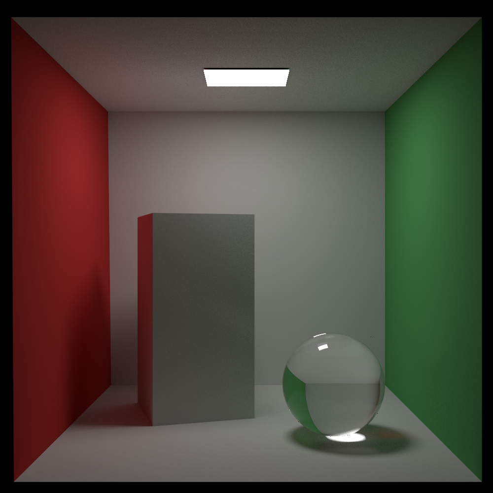
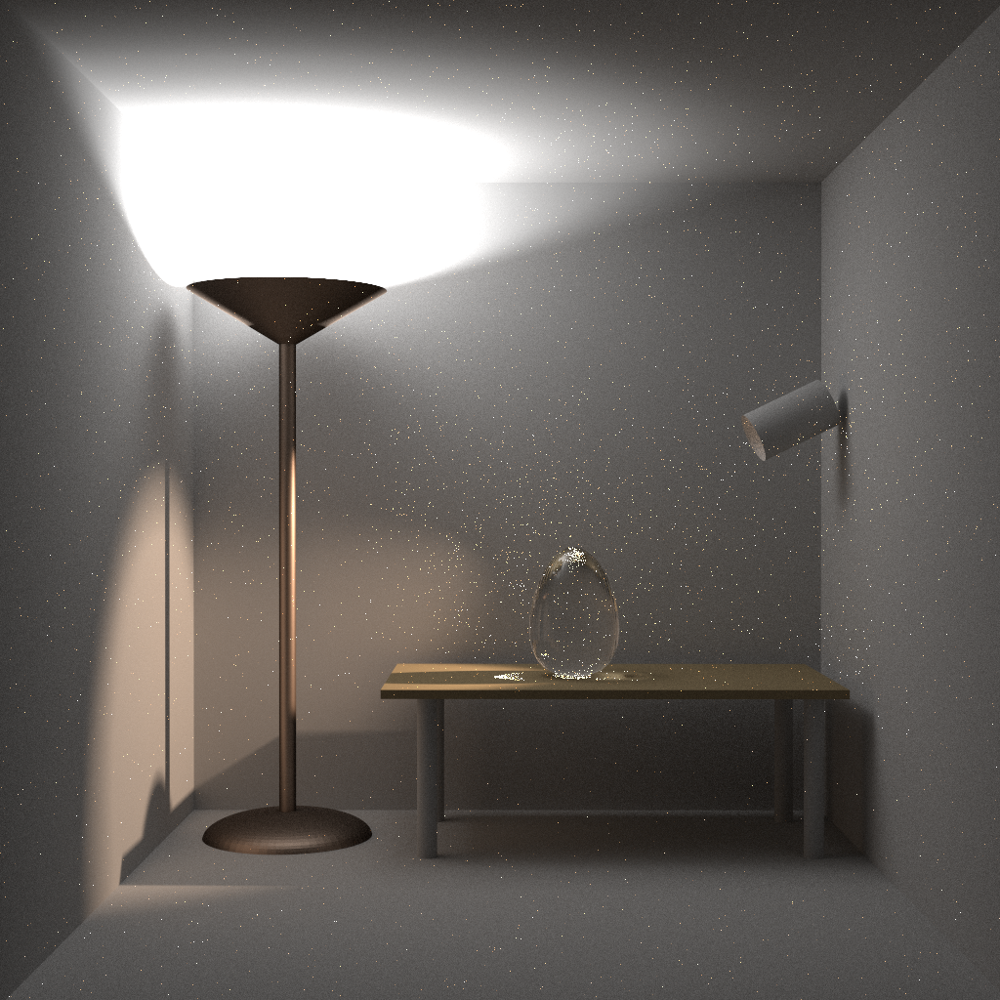

# Xeno Renderer
Hi! This is my own physically based renderer. It's name comes from my favorite video game, Xenoblade:)

## Building the code
### Cloning:
```bash
git clone https://github.com/seerier/Xeno.git
```

### Building:
Xeno uses [cmake](http://www.cmake.org/) for its build system

## Usage
To render a scene, use the following command:
```bash
xeno -f scene.json
```
where filepath is the absolute path to the json scene file.

You can alse use:
```bash
xeno -help
```
for more information.

## Selected Images


