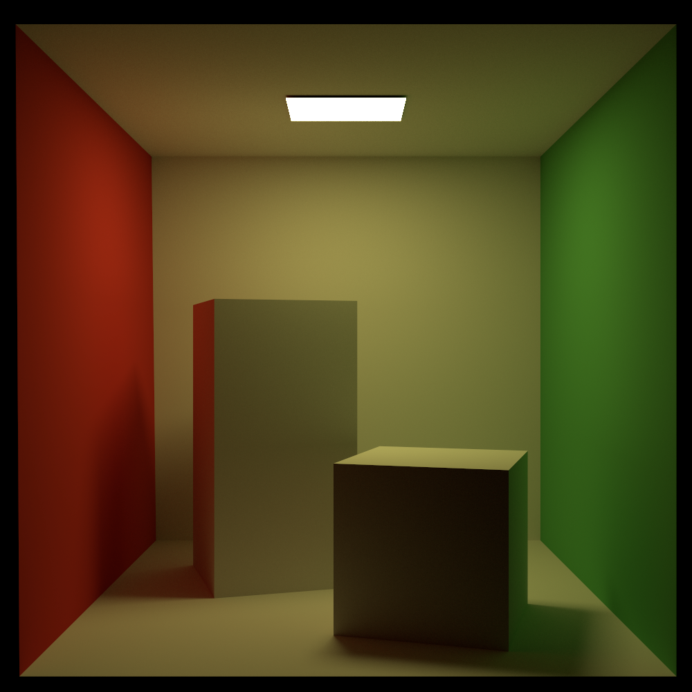
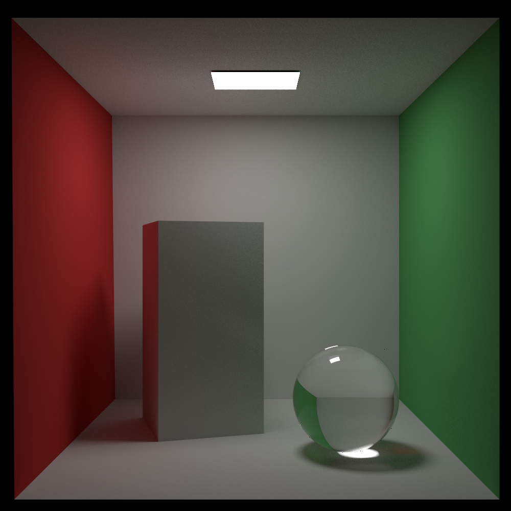
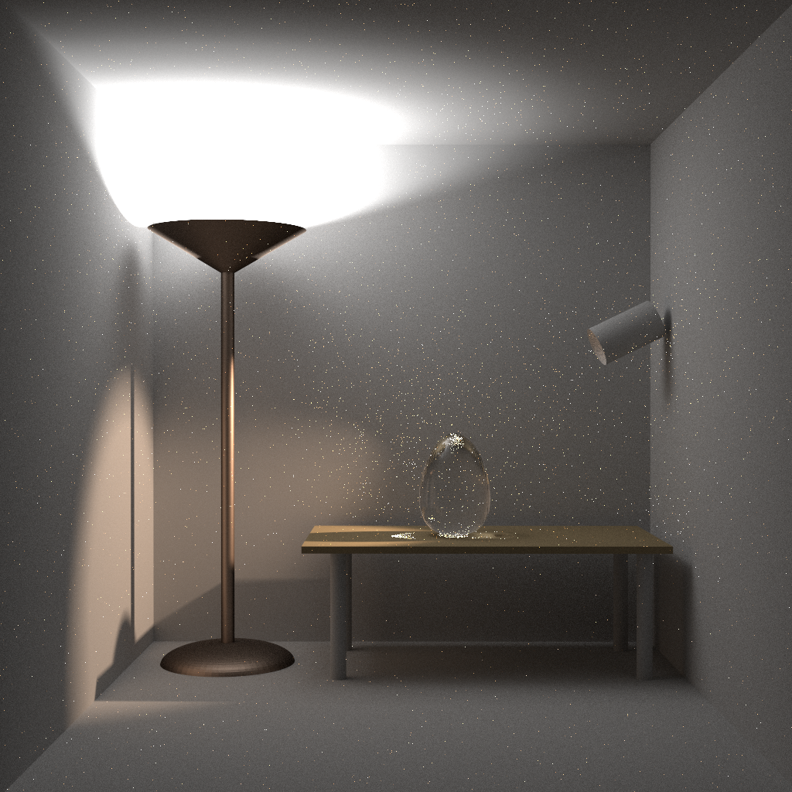

# Xeno Renderer

A physically-based Monte-Carlo renderer implementing advanced light transport algorithms, named after the Xenoblade series.

## Features

- **Path Tracing** with importance sampling and multiple importance sampling (MIS)
- **Bidirectional Path Tracing** for challenging lighting scenarios
- **Photon Mapping** and **Stochastic Progressive Photon Mapping** for specular light transport simulation
- **Multithreaded rendering** for efficient performance on multi-core systems
- **JSON-based scene configuration** for flexible scene definition

## Building

Xeno uses [cmake](http://www.cmake.org/) for its build system.

```bash
git clone https://github.com/seerier/Xeno.git
cd Xeno
mkdir build && cd build
cmake ..
make -j8
```

## Usage

To render a scene, use the following command:

```bash
xeno -f scene.json
```

where `scene.json` is the path to your scene configuration file.

### Command Line Options

```bash
xeno -f <input>              # Input scene file (required)
xeno -o <output>             # Output image filename
xeno -w, -width <num>        # Image width in pixels
xeno -h, -height <num>       # Image height in pixels
xeno -spp <num>              # Samples per pixel
xeno -nthreads <num>         # Number of parallel threads
xeno -help                   # Display help information
```

### Examples

```bash
# Basic rendering
xeno -f scenes/cbox/cbox.json

# Custom output and resolution
xeno -f scenes/cbox/cbox.json -o output.png -w 1920 -h 1080

# High quality rendering with more samples per pixel
xeno -f scenes/cbox/cbox.json -spp 256 -nthreads 8

# All options combined
xeno -f scenes/cbox/cbox.json -o result.png -w 1280 -h 720 -spp 128 -nthreads 4
```

## Gallery

### Classic Cornell Box


### Cornell Box with Specular Light Path


### Indoor Scene with Global Illumination


## References

[1] [Physically Based Rendering: From Theory to Implementation](https://www.pbrt.org/)

[2] [The Rendering Equation](https://www.cs.cmu.edu/afs/cs/academic/class/15462-s13/www/lec_slides/86kajiyaRenderingEquation.pdf)

[3] [Robust Monte Carlo Methods For Light Transport Simulation](https://graphics.stanford.edu/papers/veach_thesis/thesis.pdf)

[4] [Global Illumination using Photon Maps](https://graphics.stanford.edu/~henrik/papers/ewr7/egwr96.pdf)

[5] [Stochastic Progressive Photon Mapping](http://graphics.ucsd.edu/~henrik/papers/stochastic_progressive_photon_mapping.pdf)

[6] [Metropolis Light Transport](https://graphics.stanford.edu/papers/metro/metro.pdf)
